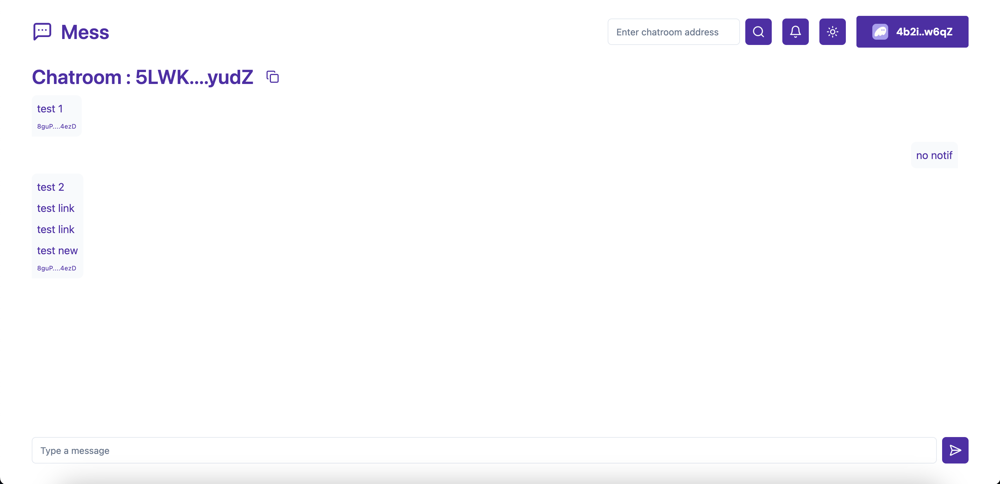

# Mess



Messaging dApp for Solana Curriculum in [freeCodeCampWeb3](https://web3.freecodecamp.org/).

[Live Website](https://chiefwoods.github.io/mess/)

[Program on Solana Explorer](https://explorer.solana.com/address/MESS6sYCuTxwEZsF8M6zrkBdUd4oNvqWCdyBTx6KFNo?cluster=devnet)

[Source Repository](https://github.com/ChiefWoods/mess)

## Built With

### Languages

- [](https://www.rust-lang.org/)
- [](https://www.typescriptlang.org/)
- [](https://react.dev/)

### Libraries

- [@solana/web3.js](https://solana-foundation.github.io/solana-web3.js/)
- [litesvm](https://github.com/LiteSVM/litesvm/tree/master/crates/node-litesvm)
- [anchor-litesvm](https://github.com/LiteSVM/anchor-litesvm/)
- [@solana/wallet-adapter-react](https://github.com/anza-xyz/wallet-adapter)
- [@dialectlabs/sdk](https://www.dialect.to/)
- [@coral-xyz/anchor](https://www.anchor-lang.com/)
- [shadcn/ui](https://ui.shadcn.com/)
- [Zod](https://zod.dev/)

### Crates

- [anchor-lang](https://docs.rs/anchor-lang/latest/anchor_lang/)

### Runtime and Test Runner

- [](https://bun.sh/)

## Getting Started

### Prerequisites

1. Update your Solana CLI, avm and Bun toolkit to the latest version

```bash
agave-install init 2.1.0
avm use 0.31.1
bun upgrade
```

### Setup

1. Clone the repository

```bash
git clone https://github.com/ChiefWoods/mess.git
```

2. Install all dependencies

```bash
bun i
```

3. Resync your program id

```bash
anchor keys sync
```

4. Build the program

```bash
anchor build
```

#### Testing

Run all `.test.ts` files under `/tests`.

```bash
bun test
```

#### Deployment

1. Configure to use localnet

```bash
solana config set -ul
```

2. Deploy the program

```bash
anchor deploy
```

3. Optionally initialize IDL

```bash
anchor idl init -f target/idl/stablecoin.json <PROGRAM_ID>
```

4. In the `app` directory, set up `.env` values

```bash
cp .env.example .env.development
```

5. Start development server

```bash
bun run dev
```

## Issues

View the [open issues](https://github.com/ChiefWoods/mess/issues) for a full list of proposed features and known bugs.

## Acknowledgements

### Resources

- [Shields.io](https://shields.io/)

### Hosting and API

- [GitHub Pages](https://pages.github.com/)
- [Helius](https://www.helius.dev/)
- [Dialect](https://www.dialect.to/)

## Contact

[chii.yuen@hotmail.com](mailto:chii.yuen@hotmail.com)
